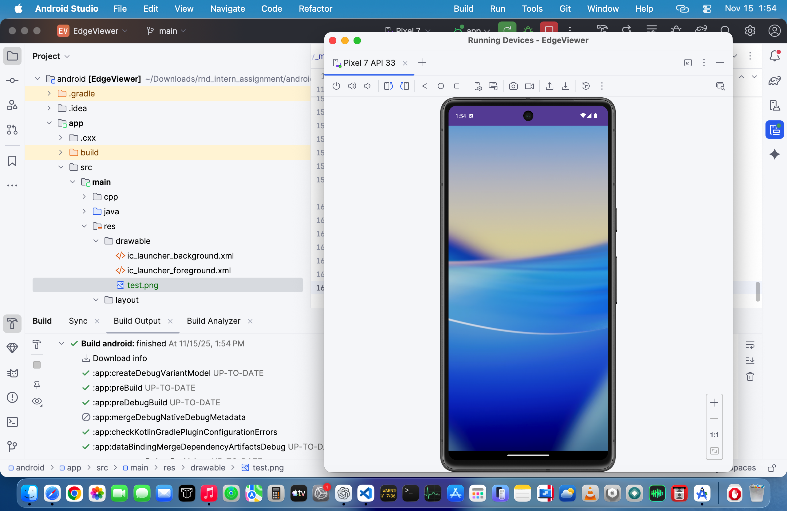
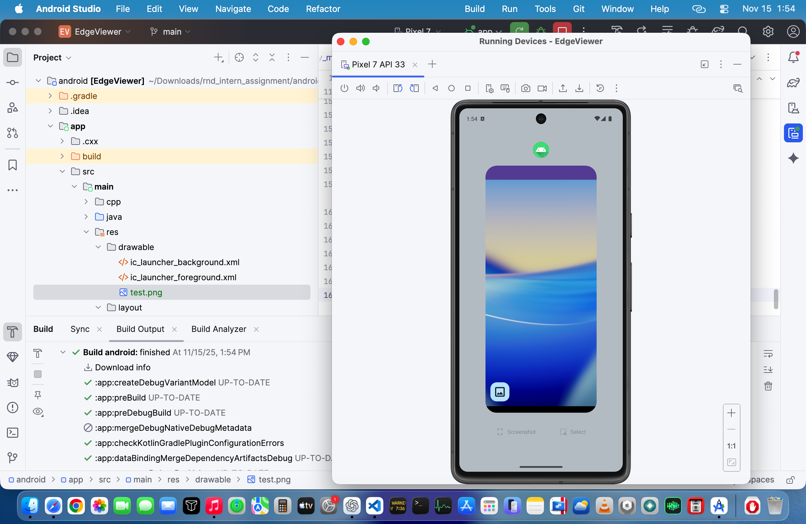
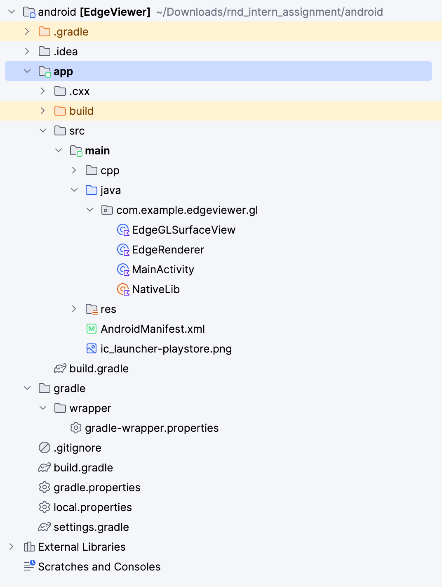

# 📸 EdgeViewer – Android Image Viewer (OpenGL ES)

EdgeViewer is a simple Android app that displays images using **OpenGL ES 2.0**.  
This project was completed as part of an internship assignment.

---

## 🚀 Features

- 📱 Displays any bitmap using OpenGL ES 2.0
- 🎨 Uses a custom GLSurfaceView + Renderer
- ⚡ Efficient GPU texture loading
- 🧩 Clean and modular Kotlin code
- 🖼️ Supports PNG/JPG image rendering
- 📂 Easy to extend for shaders, filters, or edge detection

---

## 🛠️ Tech Stack

- **Kotlin**
- **OpenGL ES 2.0**
- **GLSurfaceView / GLSurfaceView.Renderer**
- **Android Studio (Hedgehog / Latest)**

---

## 📂 Project Structure
```
app/
 ├── src/main/java/com/example/edgeviewer/gl/
 │    ├── MainActivity.kt
 │    ├── EdgeGLSurfaceView.kt
 │    ├── EdgeRenderer.kt
 │    └── NativeLib.kt
 │
 ├── src/main/res/drawable/
 │    └── test.png
 │
 └── src/main/res/layout/
      └── activity_main.xml
```

## 📷 Screenshots

### 🖼️ App Output  
Displays the uploaded PNG:




### 📁 Project Folder Structure



---

## 🌐 Web Debug Viewer

A lightweight web tool to preview processed frames exported from the Android app.

### Run Web Viewer:
```bash
cd web
npm install
npm run build
npm run start

## Then open: http://localhost:3000

### Web Output


## ▶️ How to Run

1. Clone the repository  
   ```bash
   git clone https://github.com/starkbbbk/EdgeViewer.git
